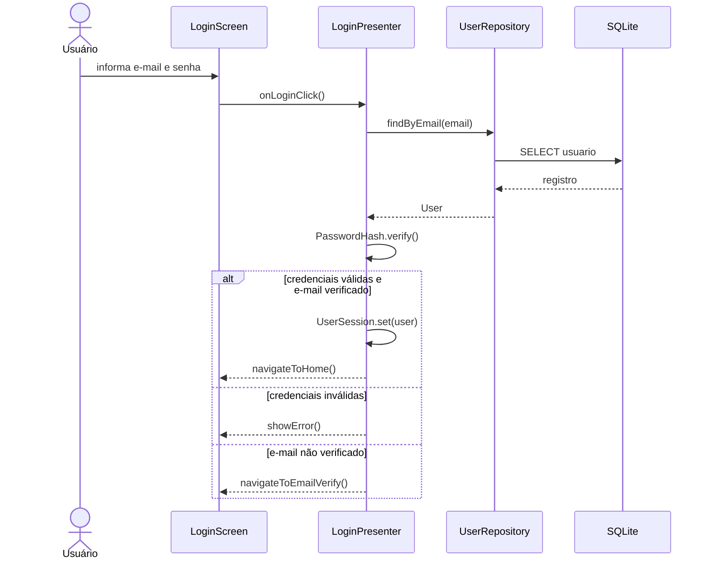
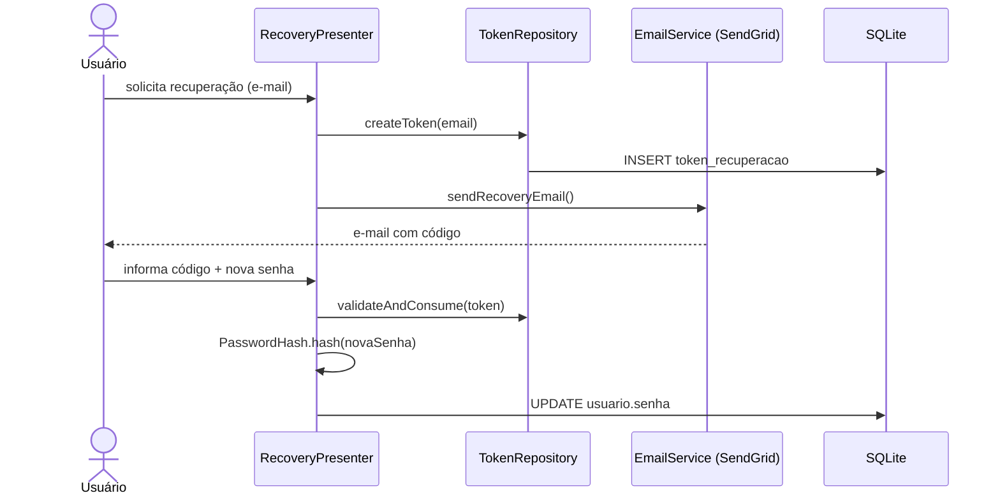
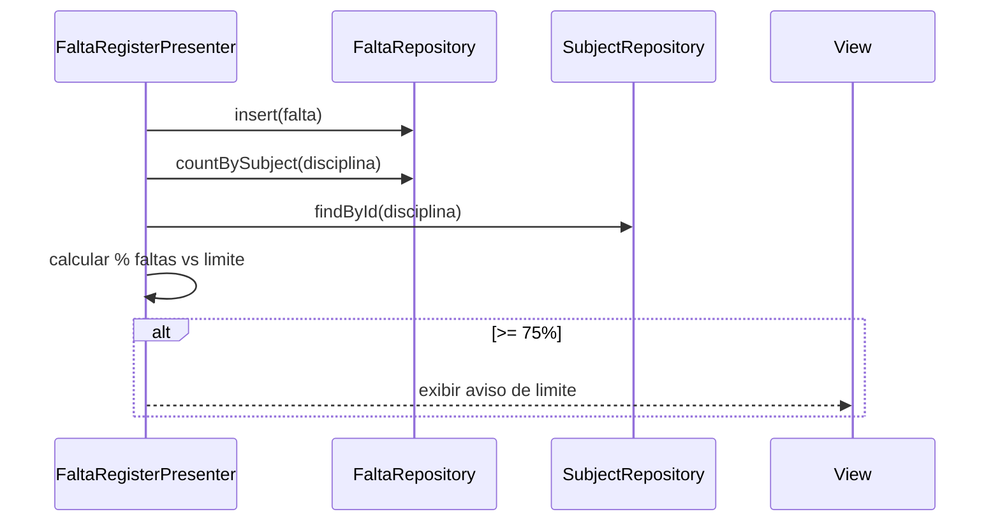
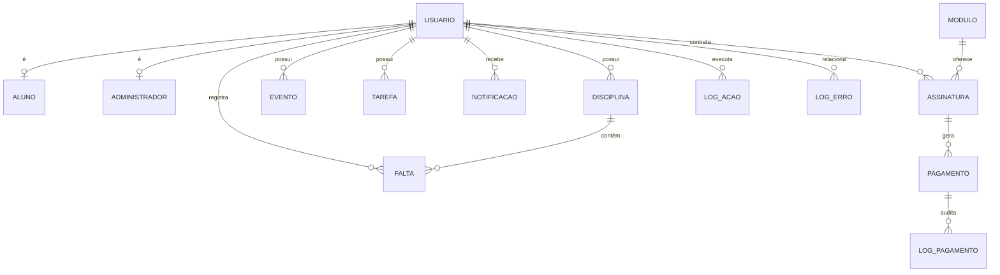

# Mochila — HUB de Ferramentas Estudantis

## Relatório de Desenvolvimento de Software (Anexo A)

### Identificação

**Curso:** Análise e Desenvolvimento de Sistemas — Fatec Campinas

**Integrantes:**

- Briena Hermsdorff Bertoni — [briena.bertoni@aluno.cps.sp.gov.br](mailto:briena.bertoni@aluno.cps.sp.gov.br)
- Heloisa de Moraes e Silva — [heloisa.silva8@aluno.cps.sp.gov.br](mailto:heloisa.silva8@aluno.cps.sp.gov.br)
- Jaqueline Neder Maiorino — [jaqueline.maiorino@aluno.cps.sp.gov.br](mailto:jaqueline.maiorino@aluno.cps.sp.gov.br)

**Orientador:** Thiago Salhab Alves — [thiago.alves01@cps.sp.gov.br](mailto:thiago.alves01@cps.sp.gov.br)

---

## 1. INTRODUÇÃO

### 1.1. Contextualização do Problema

O ambiente acadêmico exige o acompanhamento simultâneo de diversas atividades: disciplinas, carga horária, entregas, prazos, frequência e compromissos da rotina de estudos. Ferramentas genéricas de produtividade nem sempre atendem de forma eficiente às necessidades específicas dos estudantes.

Nesse contexto surge o **Mochila HUB**: plataforma voltada à gestão acadêmica e à organização estudantil, com funcionalidades como controle de faltas, gerenciamento de prazos e entregas, cadastro de eventos e organização por período letivo. A proposta é oferecer praticidade e estrutura para uma experiência de estudos mais eficiente.

### 1.2. Objetivos

**Objetivo geral**

Desenvolver uma aplicação multiplataforma que centralize ferramentas de apoio à rotina acadêmica do estudante, com foco em organização, controle de frequência e gestão de compromissos.

**Objetivos específicos**

1. Levantar e documentar requisitos funcionais e não funcionais do sistema.
2. Modelar o domínio (casos de uso, classes, dados) e definir arquitetura em camadas (MVP).
3. Implementar o pacote básico: calendário (eventos), lista de tarefas e controle de faltas.
4. Garantir autenticação segura, recuperação de senha e verificação de e-mail.
5. Prever extensibilidade via módulos pagos e perfil administrador (SaaS).
6. Validar o software por testes automatizados (JaCoCo) e evidências de uso.

### 1.3. Justificativa

A dispersão de informações acadêmicas em agendas, blocos de notas e aplicativos não especializados aumenta o risco de perda de prazos e de controle de frequência. O Mochila HUB justifica-se por:

- **Especificidade:** funcionalidades alinhadas à vida universitária (faltas por disciplina, semestre letivo, alertas de limite de ausências).
- **Portabilidade:** Kotlin Multiplatform com Android e desktop, reduzindo esforço de manutenção.
- **Autonomia local:** SQLite via JDBC, operação sem servidor obrigatório.
- **Evolução comercial:** modelo de módulos e assinaturas previsto no desenho do sistema.
- **Conformidade:** tratamento de dados pessoais alinhado à LGPD e boas práticas de segurança (senha com hash, tokens de recuperação).

### 1.4. Metodologia de Desenvolvimento

Adotou-se abordagem **ágil inspirada em Scrum/Kanban**, adequada ao escopo acadêmico e à equipe reduzida:

| Prática | Aplicação no projeto |
|--------|----------------------|
| Backlog de requisitos | R01–R22 documentados e priorizados (pacote básico primeiro) |
| Iterações | Entregas incrementais: autenticação → módulos básicos → testes |
| Revisão | Validação com orientador e cobertura JaCoCo |
| Kanban | Acompanhamento de tarefas (Notion / ferramentas da equipe) |

Não foi utilizada metodologia em cascata pura, pois o produto evoluiu com feedback contínuo entre modelagem, implementação e testes.

---

## 2. LEVANTAMENTO E ANÁLISE DE REQUISITOS

### 2.1. Descrição dos Stakeholders (Atores do Sistema)

| Ator | Tipo | Descrição | Interação principal |
|------|------|-----------|---------------------|
| **Usuário (Estudante)** | Humano | Utiliza cadastro, login, calendário, tarefas e faltas | UC01–UC11, UC14–UC15 |
| **Administrador** | Humano | Gerencia catálogo de módulos do HUB | UC16 |
| **Provedor de Identidade** | Sistema externo | Emissão/revogação de credenciais e tokens (conceitual no diagrama) | UC02, UC03, UC17–UC18 |
| **Gateway de Pagamento** | Sistema externo | Processamento de assinaturas de módulos | UC15 |
| **Sistema (Mochila HUB)** | Software | Validações, logs, notificações, persistência | UC04, UC07, UC12, UC19 |

*Generalização no modelo de classes:* todo usuário autenticado pode ser **Aluno**; perfil **Administrador** estende capacidades de gestão de módulos.

### 2.2. Requisitos Funcionais (RF)

| ID | Requisito |
|----|-----------|
| **RF01** | Cadastro de usuário após verificação de e-mail duplicado |
| **RF02** | Login e logout com níveis de acesso por perfil |
| **RF03** | Recuperação de senha por e-mail ou outro método seguro |
| **RF04** | Acesso ao pacote básico: Calendário, Tarefas e Faltas |
| **RF05** | CRUD de eventos no calendário |
| **RF06** | Visualização de eventos por dia, semana e mês |
| **RF07** | Notificações (e-mail ou push) para eventos |
| **RF08** | CRUD de tarefas |
| **RF09** | Priorização de tarefas (prioridade + data de vencimento) |
| **RF10** | Categorização de eventos e tarefas |
| **RF11** | CRUD de registros de falta |
| **RF12** | Consulta de faltas registradas e limite por disciplina |
| **RF13** | Aviso ao atingir ≥ 75% do limite de faltas |
| **RF14** | Pesquisa e filtros em calendário, tarefas e faltas |
| **RF15** | Vínculo de evento, tarefa, falta e disciplina ao usuário |
| **RF16** | Assinatura de novos módulos |
| **RF17** | CRUD de módulos pelo administrador |

### 2.3. Requisitos Não Funcionais (RNF)

| ID | Requisito |
|----|-----------|
| **RNF01** | Autenticação baseada em tokens ou sessão segura |
| **RNF02** | Interface intuitiva e responsiva (desktop e móvel) |
| **RNF03** | Disponibilidade 24×7 (quando implantado em ambiente online) |
| **RNF04** | Conformidade com a LGPD |
| **RNF05** | Registro de logs (ação, erro, pagamento) para auditoria |

*Observação de implementação:* na versão atual, a persistência é **local (SQLite)**; RNF03 aplica-se à arquitetura alvo em nuvem; logs e módulos pagos estão modelados no banco e parcialmente na aplicação.

### 2.4. Regras de Negócio

| ID | Regra |
|----|-------|
| **RN01** | E-mail de usuário deve ser único no cadastro |
| **RN02** | Senha armazenada apenas com hash (PBKDF2), nunca em texto claro |
| **RN03** | Token de recuperação de senha expira em 15 minutos e é de uso único |
| **RN04** | Conta só acessa o home após verificação de e-mail |
| **RN05** | Evento, tarefa, disciplina e falta pertencem a um único `id_usuario` |
| **RN06** | Falta sempre vinculada a uma disciplina do mesmo usuário |
| **RN07** | Alerta de faltas quando `faltas_registradas / limite_permitido ≥ 0,75` |
| **RN08** | Tarefas ordenadas por prioridade; empate resolve por data limite mais próxima |
| **RN09** | Status de evento: Agendado, Em andamento, Finalizado, Cancelado |
| **RN10** | Status de tarefa: Pendente, Em andamento, Cancelada, Concluída |
| **RN11** | Status de falta: Justificada, Não Justificada, Registrada |
| **RN12** | Módulos básicos (Agenda, To Do, Controle de Faltas) com preço zero no catálogo |
| **RN13** | Exclusão em cascata: remover usuário remove dados dependentes (FK ON DELETE CASCADE) |

---

## 3. PROJETO DO SISTEMA (DESIGN)

### 3.1. Arquitetura do Software

**Padrão:** arquitetura em **camadas** inspirada em **MVP (Model–View–Presenter)**.

```
┌─────────────────────────────────────┐
│  View (Compose Screens)             │
│  Login, Home, EventList, TaskList...│
└──────────────┬──────────────────────┘
               │ interface View
┌──────────────▼──────────────────────┐
│  Presenter (validação + regras)     │
└──────────────┬──────────────────────┘
               │
┌──────────────▼──────────────────────┐
│  Repository (SQL parametrizado)     │
└──────────────┬──────────────────────┘
               │
┌──────────────▼──────────────────────┐
│  Model + SQLite (mochila.db / JDBC)  │
└─────────────────────────────────────┘
```

**Navegação:** pilha manual de telas (`screenStack`) em `App.kt`, sem NavHost declarativo.

**Módulo:** único Gradle `composeApp` (KMP: `commonMain`, `androidMain`, `jvmMain`).

### 3.2. Diagramas de Casos de Uso

> Inserir imagem: *Diagrama de caso de uso - Mochila.drawio*

**Figura 1** — Diagrama de Casos de Uso — Mochila HUB

#### Tabela resumo dos casos de uso

| UC | Nome | Ator | Relacionamentos |
|----|------|------|-----------------|
| UC01 | Cadastrar Usuário | Usuário | Inclui UC04, UC17 |
| UC02 | Autenticar Login/Logout | Usuário | Inclui UC18, UC21 |
| UC03 | Recuperar Senha | Usuário | Inclui UC07, UC21 |
| UC04 | Verificar Duplicidade de E-mail | Sistema | Estendido por UC12 |
| UC05 | Gerenciar Eventos (CRUD) | Usuário | Inclui UC10, UC21; estende UC07 |
| UC06 | Visualizar Eventos | Usuário | Inclui UC14, UC21 |
| UC07 | Enviar Notificação | Sistema | Inclui UC21 |
| UC08 | Gerenciar Tarefas (CRUD) | Usuário | Inclui UC09, UC21 |
| UC09 | Priorizar Tarefas | Usuário | Estende UC08 |
| UC10 | Categorizar Itens | Usuário | Incluído por UC05, UC08 |
| UC11 | Gerenciar Faltas (CRUD) | Usuário | Inclui UC14, UC21 |
| UC12 | Exibir Erro de Duplicidade | Sistema | Estende UC04 |
| UC14 | Pesquisar/Filtrar Registros | Usuário | Transversal |
| UC15 | Assinar Novo Módulo | Usuário | Gateway de Pagamento |
| UC16 | Gerenciar Módulos (CRUD) | Administrador | Inclui UC21 |
| UC17 | Gerar Credenciais | Sistema | Incluído por UC01 |
| UC18 | Emitir/Revogar Token | Sistema | Incluído por UC02 |
| UC21 | Registrar Log | Sistema | Transversal |

#### 3.2.1 Narrativas de casos de uso

##### UC01 — Cadastrar Usuário

**Objetivo:** Permitir que um novo usuário realize cadastro na plataforma.

**Ator principal:** Usuário.

**Pré-condições:** O usuário não deve possuir cadastro prévio com o mesmo e-mail.

**Pós-condições:** Conta criada com sucesso e credenciais geradas.

**Fluxo principal**

1. O usuário acessa a tela de cadastro.
2. O sistema solicita nome, e-mail e senha.
3. O usuário preenche os dados solicitados.
4. O sistema executa UC04 — Verificar Duplicidade de E-mail.
5. O sistema executa UC17 — Gerar Credenciais.
6. O sistema confirma o cadastro realizado.

**Fluxo alternativo**

4A. Caso o e-mail informado já exista, o sistema executa UC12 — Exibir Erro de Duplicidade.

##### UC02 — Autenticar Login/Logout

**Objetivo:** Permitir autenticação segura do usuário no sistema.

**Ator principal:** Usuário.

**Pré-condições:** Usuário cadastrado no sistema.

**Pós-condições:** Sessão autenticada ou encerrada corretamente.

**Fluxo principal**

1. O usuário informa e-mail e senha.
2. O sistema valida as credenciais.
3. O sistema executa UC18 — Emitir/Revogar Token.
4. O sistema concede acesso à plataforma.
5. O sistema executa UC21 — Registrar Log.

**Fluxo alternativo**

2A. Caso as credenciais estejam inválidas, o sistema exibe mensagem de erro.

##### UC03 — Recuperar Senha

**Objetivo:** Permitir redefinição da senha do usuário.

**Ator principal:** Usuário.

**Pré-condições:** O usuário deve possuir e-mail cadastrado.

**Pós-condições:** Nova senha cadastrada com sucesso.

**Fluxo principal**

1. O usuário solicita recuperação de senha.
2. O sistema solicita o e-mail cadastrado.
3. O sistema valida o e-mail informado.
4. O sistema executa UC07 — Enviar Notificação.
5. O usuário redefine a senha.
6. O sistema salva a nova senha.
7. O sistema executa UC21 — Registrar Log.

**Fluxo alternativo**

3A. Caso o e-mail não exista, o sistema informa erro ao usuário.

##### UC04 — Verificar Duplicidade de E-mail

**Objetivo:** Verificar se o e-mail informado já está cadastrado.

**Ator principal:** Sistema.

**Pré-condições:** Usuário informar um e-mail válido.

**Pós-condições:** O sistema identifica disponibilidade do e-mail.

**Fluxo principal**

1. O sistema recebe o e-mail informado.
2. O sistema consulta a base de dados.
3. O sistema verifica existência do e-mail.
4. O sistema retorna o resultado da verificação.

**Fluxo alternativo**

3A. Caso o e-mail já exista, o sistema executa UC12 — Exibir Erro de Duplicidade.

##### UC05 — Gerenciar Eventos (CRUD)

**Objetivo:** Permitir gerenciamento completo de eventos acadêmicos.

**Ator principal:** Usuário.

**Pré-condições:** Usuário autenticado.

**Pós-condições:** Evento criado, atualizado ou removido.

**Fluxo principal**

1. O usuário acessa o módulo de eventos.
2. O usuário escolhe criar, editar, visualizar ou excluir evento.
3. O sistema solicita os dados do evento.
4. O sistema executa UC10 — Categorizar Itens.
5. O sistema salva as alterações.
6. O sistema executa UC21 — Registrar Log.

**Fluxo alternativo**

5A. O sistema pode executar UC07 — Enviar Notificação para lembrar eventos próximos.

##### UC06 — Visualizar Eventos

**Objetivo:** Permitir consulta de eventos acadêmicos.

**Ator principal:** Usuário.

**Pré-condições:** Existirem eventos cadastrados.

**Pós-condições:** Eventos exibidos ao usuário.

**Fluxo principal**

1. O usuário acessa a área de eventos.
2. O sistema apresenta lista ou calendário.
3. O usuário utiliza UC14 — Pesquisar/Filtrar Registros.
4. O sistema exibe os resultados encontrados.
5. O sistema executa UC21 — Registrar Log.

**Fluxo alternativo**

2A. Caso não existam eventos cadastrados, o sistema informa ausência de registros.

##### UC07 — Enviar Notificação

**Objetivo:** Enviar notificações relacionadas às ações do sistema.

**Ator principal:** Sistema.

**Pré-condições:** Existir evento que exija notificação.

**Pós-condições:** Notificação enviada ao usuário.

**Fluxo principal**

1. O sistema identifica necessidade de envio.
2. O sistema gera a mensagem.
3. O sistema envia a notificação.
4. O sistema executa UC21 — Registrar Log.

**Fluxo alternativo**

3A. Caso haja falha no envio, o sistema registra erro.

##### UC08 — Gerenciar Tarefas (CRUD)

**Objetivo:** Permitir gerenciamento de tarefas acadêmicas.

**Ator principal:** Usuário.

**Pré-condições:** Usuário autenticado.

**Pós-condições:** Tarefa criada, atualizada, concluída ou removida.

**Fluxo principal**

1. O usuário acessa o módulo de tarefas.
2. O usuário cria, edita, conclui ou remove tarefa.
3. O sistema executa UC09 — Priorizar Tarefas.
4. O sistema salva as alterações.
5. O sistema executa UC21 — Registrar Log.

**Fluxo alternativo**

2A. O usuário pode utilizar UC14 — Pesquisar/Filtrar Registros para localizar tarefas.

##### UC09 — Priorizar Tarefas

**Objetivo:** Definir prioridade para tarefas acadêmicas.

**Ator principal:** Usuário.

**Pré-condições:** Existir tarefa cadastrada.

**Pós-condições:** Prioridade atribuída à tarefa.

**Fluxo principal**

1. O usuário seleciona uma tarefa.
2. O sistema apresenta níveis de prioridade.
3. O usuário define a prioridade desejada.
4. O sistema salva a configuração.

**Fluxo alternativo**

3A. O usuário pode cancelar a alteração antes da confirmação.

##### UC10 — Categorizar Itens

**Objetivo:** Organizar itens em categorias específicas.

**Ator principal:** Usuário.

**Pré-condições:** Existirem registros cadastrados.

**Pós-condições:** Item associado à categoria selecionada.

**Fluxo principal**

1. O usuário seleciona um item.
2. O sistema apresenta categorias disponíveis.
3. O usuário escolhe a categoria desejada.
4. O sistema salva a categorização.

**Fluxo alternativo**

2A. O usuário pode criar uma nova categoria.

##### UC11 — Gerenciar Registros de Falta (CRUD)

**Objetivo:** Permitir gerenciamento de faltas acadêmicas.

**Ator principal:** Usuário.

**Pré-condições:** Usuário autenticado.

**Pós-condições:** Registro de falta atualizado no sistema.

**Fluxo principal**

1. O usuário acessa o módulo de faltas.
2. O usuário cria, edita ou remove registro.
3. O sistema executa UC14 — Pesquisar/Filtrar Registros.
4. O sistema salva as alterações.
5. O sistema executa UC21 — Registrar Log.

**Fluxo alternativo**

2A. Caso os dados estejam inválidos, o sistema exibe erro.

##### UC12 — Exibir Erro de Duplicidade

**Objetivo:** Informar que o e-mail já está cadastrado.

**Ator principal:** Sistema.

**Pré-condições:** E-mail duplicado identificado.

**Pós-condições:** Usuário informado sobre duplicidade.

**Fluxo principal**

1. O sistema identifica que o e-mail já existe.
2. O sistema exibe mensagem de erro.
3. O usuário é orientado a utilizar outro e-mail.

##### UC14 — Pesquisar/Filtrar Registros

**Objetivo:** Permitir pesquisa e filtragem de informações.

**Ator principal:** Usuário.

**Pré-condições:** Existirem registros cadastrados.

**Pós-condições:** Resultados filtrados exibidos.

**Fluxo principal**

1. O usuário acessa a funcionalidade de busca.
2. O usuário informa filtros ou palavras-chave.
3. O sistema processa a pesquisa.
4. O sistema apresenta os resultados encontrados.

**Fluxo alternativo**

3A. Caso não existam resultados, o sistema informa ausência de registros.

##### UC15 — Assinar Novo Módulo

**Objetivo:** Permitir contratação de novos módulos da plataforma.

**Ator principal:** Usuário.

**Pré-condições:** Usuário autenticado.

**Pós-condições:** Módulo habilitado para utilização.

**Fluxo principal**

1. O usuário acessa a área de módulos.
2. O sistema apresenta os módulos disponíveis.
3. O usuário seleciona um módulo.
4. O sistema envia solicitação ao gateway de pagamento.
5. O pagamento é aprovado.
6. O sistema habilita o módulo contratado.

**Fluxo alternativo**

5A. Caso o pagamento seja recusado, o sistema informa falha na contratação.

##### UC16 — Gerenciar Módulos (CRUD)

**Objetivo:** Permitir administração dos módulos do sistema.

**Ator principal:** Administrador.

**Pré-condições:** Administrador autenticado.

**Pós-condições:** Módulo criado, alterado ou removido.

**Fluxo principal**

1. O administrador acessa o painel de módulos.
2. O administrador cria, edita, ativa ou remove módulo.
3. O sistema salva as alterações realizadas.
4. O sistema executa UC21 — Registrar Log.

**Fluxo alternativo**

2A. Caso existam dependências vinculadas ao módulo, o sistema impede sua exclusão.

##### UC17 — Gerar Credenciais

**Objetivo:** Gerar dados de autenticação para novos usuários.

**Ator principal:** Sistema.

**Pré-condições:** Cadastro validado com sucesso.

**Pós-condições:** Credenciais criadas e associadas ao usuário.

**Fluxo principal**

1. O sistema recebe os dados do usuário.
2. O sistema criptografa a senha.
3. O sistema gera as credenciais de autenticação.
4. O sistema armazena as informações de acesso.

##### UC18 — Emitir/Revogar Token

**Objetivo:** Gerenciar tokens de autenticação das sessões.

**Ator principal:** Sistema.

**Pré-condições:** Usuário autenticado ou solicitando logout.

**Pós-condições:** Token criado ou invalidado.

**Fluxo principal**

1. O sistema recebe solicitação de login ou logout.
2. O sistema gera ou invalida o token.
3. O sistema atualiza o estado da sessão.

**Fluxo alternativo**

2A. Caso ocorra falha, o sistema impede autenticação.

##### UC21 — Registrar Log

**Objetivo:** Registrar ações importantes realizadas no sistema.

**Ator principal:** Sistema.

**Pré-condições:** Execução de operação relevante no sistema.

**Pós-condições:** Log armazenado para auditoria e rastreabilidade.

**Fluxo principal**

1. O sistema identifica a ação executada.
2. O sistema coleta informações da operação.
3. O sistema registra data, usuário e ação realizada.
4. O log é armazenado na base de dados.

### 3.3. Diagramas de Sequência (Processos Críticos)

#### UC02 — Autenticação (Login)



#### UC03 — Recuperação de senha



#### UC11 — Registrar falta com alerta de limite



### 3.4. Diagrama de Classes

> Inserir imagem: *Diagrama de Classe - Mochila*

**Figura 2** — Diagrama de Classes — Mochila HUB

**Entidades principais:** `Usuario` (generalização para `Aluno` e `Administrador`), `Disciplina`, `Falta`, `Evento`, `Tarefa`, `Notificacao`, `Modulo`, `Assinatura`, `Pagamento`, `LogAcao`, `LogErro`, `LogPagamento`.

**Relacionamentos (cardinalidade):**

- Usuário 1 — 0..* Disciplina, Evento, Tarefa, Notificacao, LogAcao, LogErro, Assinatura
- Disciplina 1 — 0..* Falta
- Assinatura n — 1 Modulo; Assinatura 1 — 0..n Pagamento
- Pagamento 1 — 1..n LogPagamento

### 3.5. Projeto de Interface (UI/UX)

- **Design system:** Material Design 3 (Compose Material3).
- **Fluxo principal:** Login → (verificação de e-mail) → Home → módulos (menu lateral).
- **Telas implementadas:** Login, Cadastro, Recuperação, Código por e-mail, Nova senha, Verificação de e-mail, Home, Lista/Cadastro de eventos, Lista/Cadastro de tarefas, Disciplinas, Registro de faltas, Configurações da conta.
- **Protótipo:** interface de baixa/média fidelidade nas telas Compose; inserir capturas na seção 6.3.
- **Acessibilidade:** labels em campos de formulário; navegação por pilha com botão voltar consistente.

---

## 4. MODELAGEM DE DADOS

### 4.1. Modelo Entidade-Relacionamento (MER)

**Entidades:** USUARIO, ALUNO, ADMINISTRADOR, DISCIPLINA, FALTA, EVENTO, TAREFA, NOTIFICACAO, MODULO, ASSINATURA, PAGAMENTO, TOKEN_RECUPERACAO, LOG_ACAO, LOG_ERRO, LOG_PAGAMENTO.

**Relacionamentos:**

- USUARIO especializa ALUNO e ADMINISTRADOR (1:1).
- USUARIO possui DISCIPLINA, EVENTO, TAREFA, NOTIFICACAO, ASSINATURA (1:N).
- DISCIPLINA possui FALTA (1:N).
- MODULO possui ASSINATURA (1:N); ASSINATURA possui PAGAMENTO (1:N).
- PAGAMENTO possui LOG_PAGAMENTO (1:N).

### 4.2. Diagrama Entidade-Relacionamento (DER)



O DER físico está implementado em `composeApp/src/commonMain/composeResources/files/db_init.sql` (SQLite, arquivo `mochila.db`).

### 4.3. Dicionário de Dados

#### Tabela: usuario

| Campo | Tipo | Descrição |
|-------|------|-----------|
| id_usuario | INTEGER PK | Identificador único |
| nome | TEXT NOT NULL | Nome completo |
| email | TEXT UNIQUE NOT NULL | Login e contato |
| senha | TEXT NOT NULL | Hash PBKDF2 (`salt:hash`) |
| email_verificado | INTEGER DEFAULT 0 | 0 = não verificado; 1 = verificado |
| criado_em | DATETIME | Data de criação |
| atualizado_em | DATETIME | Última atualização |

#### Tabela: aluno

| Campo | Tipo | Descrição |
|-------|------|-----------|
| id_aluno | INTEGER PK | Identificador |
| id_usuario | INTEGER FK UNIQUE | Referência ao usuário |
| criado_em | DATETIME | Data de criação |
| atualizado_em | DATETIME | Última atualização |

#### Tabela: administrador

| Campo | Tipo | Descrição |
|-------|------|-----------|
| id_adm | INTEGER PK | Identificador |
| id_usuario | INTEGER FK UNIQUE | Referência ao usuário |
| criado_em | DATETIME | Data de criação |
| atualizado_em | DATETIME | Última atualização |

#### Tabela: disciplina

| Campo | Tipo | Descrição |
|-------|------|-----------|
| id_disciplina | INTEGER PK | Identificador |
| id_usuario | INTEGER FK | Dono da disciplina |
| nome | TEXT NOT NULL | Nome da matéria |
| professor | TEXT NOT NULL | Nome do docente |
| frequencia_minima | INTEGER NOT NULL | Percentual mínimo de presença |
| data_inicio | DATETIME NOT NULL | Início do período |
| data_fim | DATETIME NOT NULL | Fim do período |
| hora_aula | INTEGER NOT NULL | Carga horária por aula |
| semestre | TEXT NOT NULL | Período letivo |
| criado_em | DATETIME | Data de criação |
| atualizado_em | DATETIME | Última atualização |

#### Tabela: falta

| Campo | Tipo | Descrição |
|-------|------|-----------|
| id_falta | INTEGER PK | Identificador |
| id_usuario | INTEGER FK | Usuário |
| id_disciplina | INTEGER FK | Disciplina vinculada |
| data_falta | DATE NOT NULL | Data da ausência |
| status | TEXT | Justificada, Nao Justificada, Registrada |
| criado_em | DATETIME | Data de criação |
| atualizado_em | DATETIME | Última atualização |

#### Tabela: evento

| Campo | Tipo | Descrição |
|-------|------|-----------|
| id_evento | INTEGER PK | Identificador |
| id_usuario | INTEGER FK | Dono do evento |
| titulo | TEXT NOT NULL | Título |
| descricao | TEXT | Descrição opcional |
| data_evento | DATETIME NOT NULL | Data e hora |
| status | TEXT | Agendado, Em andamento, Finalizado, Cancelado |
| criado_em | DATETIME | Data de criação |
| atualizado_em | DATETIME | Última atualização |

#### Tabela: tarefa

| Campo | Tipo | Descrição |
|-------|------|-----------|
| id_tarefa | INTEGER PK | Identificador |
| id_usuario | INTEGER FK | Dono da tarefa |
| titulo | TEXT NOT NULL | Título |
| descricao | TEXT NOT NULL | Descrição |
| status | TEXT | Pendente, Em andamento, Cancelada, Concluida |
| blockers | TEXT | Impedimentos |
| data_limite | DATETIME | Prazo de entrega |
| criado_em | DATETIME | Data de criação |
| atualizado_em | DATETIME | Última atualização |

#### Tabela: token_recuperacao

| Campo | Tipo | Descrição |
|-------|------|-----------|
| id | INTEGER PK | Identificador |
| email | TEXT NOT NULL | E-mail do solicitante |
| token | TEXT NOT NULL | Código de recuperação |
| expira_em | DATETIME NOT NULL | Validade (15 minutos) |
| usado | INTEGER DEFAULT 0 | 0 = válido; 1 = consumido |
| criado_em | DATETIME | Data de criação |

#### Tabela: modulo

| Campo | Tipo | Descrição |
|-------|------|-----------|
| id_modulo | INTEGER PK | Identificador |
| nome | TEXT UNIQUE NOT NULL | Nome do módulo |
| descricao | TEXT | Descrição |
| preco | DECIMAL(10,2) | Valor (0,00 para pacote básico) |
| criado_em | DATETIME | Data de criação |
| atualizado_em | DATETIME | Última atualização |

#### Tabela: assinatura

| Campo | Tipo | Descrição |
|-------|------|-----------|
| id_assinatura | INTEGER PK | Identificador |
| id_usuario | INTEGER FK | Assinante |
| id_modulo | INTEGER FK | Módulo contratado |
| status | TEXT | Ativa, Inativa, Cancelada |
| data_inicio | DATETIME | Início da assinatura |
| data_fim | DATETIME | Término |
| criado_em | DATETIME | Data de criação |
| atualizado_em | DATETIME | Última atualização |

#### Tabela: pagamento

| Campo | Tipo | Descrição |
|-------|------|-----------|
| id_pagamento | INTEGER PK | Identificador |
| id_usuario | INTEGER FK | Pagador |
| id_assinatura | INTEGER FK | Assinatura vinculada |
| valor | DECIMAL(10,2) NOT NULL | Valor pago |
| moeda | TEXT DEFAULT BRL | Moeda |
| metodo | TEXT | Cartao, Pix, Boleto, PayPal, MercadoPago |
| status | TEXT | Pendente, Pago, Cancelado, Falhou |
| gateway | TEXT | Identificador do gateway |
| criado_em | DATETIME | Data de criação |
| atualizado_em | DATETIME | Última atualização |

#### Tabela: notificacao

| Campo | Tipo | Descrição |
|-------|------|-----------|
| id_notificacao | INTEGER PK | Identificador |
| id_usuario | INTEGER FK | Destinatário |
| titulo | TEXT NOT NULL | Título |
| mensagem | TEXT NOT NULL | Corpo da mensagem |
| criado_em | DATETIME | Data de criação |
| atualizado_em | DATETIME | Última atualização |

#### Tabela: log_acao

| Campo | Tipo | Descrição |
|-------|------|-----------|
| id_acao | INTEGER PK | Identificador |
| id_usuario | INTEGER FK | Usuário da ação |
| acao | TEXT NOT NULL | Tipo de ação |
| descricao | TEXT | Detalhes |
| ip_origem | TEXT | IP de origem |
| tabela_afetada | TEXT NOT NULL | Tabela alterada |
| id_registro_afetado | INTEGER | ID do registro |
| criado_em | DATETIME | Data do log |

#### Tabela: log_erro

| Campo | Tipo | Descrição |
|-------|------|-----------|
| id_erro | INTEGER PK | Identificador |
| id_usuario | INTEGER FK | Usuário (opcional) |
| modulo | TEXT NOT NULL | Módulo com erro |
| mensagem | TEXT NOT NULL | Mensagem de erro |
| criado_em | DATETIME | Data do log |

#### Tabela: log_pagamento

| Campo | Tipo | Descrição |
|-------|------|-----------|
| id_log_pagamento | INTEGER PK | Identificador |
| id_pagamento | INTEGER FK | Pagamento relacionado |
| status_gateway | TEXT NOT NULL | Status retornado pelo gateway |
| mensagem | TEXT | Mensagem adicional |
| payload | TEXT | Resposta bruta do gateway |
| criado_em | DATETIME | Data do log |

---

## 5. DESENVOLVIMENTO (IMPLEMENTAÇÃO)

### 5.1. Ambiente de Desenvolvimento

| Item | Especificação |
|------|----------------|
| **Hardware** | PC com Windows 10+ (ambiente de desenvolvimento da equipe) |
| **SO alvo** | Android 7+ (API 24+), Desktop Windows/macOS/Linux (JVM) |
| **Build** | Gradle (wrapper do projeto) |
| **Banco local** | `mochila.db` via SQLite JDBC |

### 5.2. Tecnologias Utilizadas

| Categoria | Tecnologia |
|-----------|------------|
| Linguagem | Kotlin Multiplatform |
| UI | Compose Multiplatform, Material 3 |
| Persistência | SQLite 3, JDBC (`sqlite-jdbc:3.45.3.0`) |
| Datas | `kotlinx-datetime:0.6.0` |
| Testes | Kotlin Test, JaCoCo |
| IDE | Android Studio / IntelliJ IDEA |
| E-mail | SendGrid API (`EmailService`) |

**Compatibilidade:** Android (minSdk 24) e Desktop JVM (janela nativa).

**Estrutura do projeto:** módulo único `composeApp` com código compartilhado em `commonMain` e entry points em `androidMain` e `jvmMain`.

### 5.3. Integrações e APIs de Terceiros

| Integração | Finalidade | Configuração |
|------------|------------|--------------|
| **SendGrid** | Verificação de e-mail e recuperação de senha | `composeApp/sendgrid.properties` ou variáveis `SENDGRID_API_KEY`, `SENDGRID_SENDER_EMAIL` |
| **Gateway de Pagamento** | Assinatura de módulos (UC15) | Modelado em `pagamento` e `log_pagamento`; integração prevista |
| **Provedor de Identidade** | Tokens e credenciais (diagrama UML) | Implementação local: `UserSession`, `token_recuperacao` |

### 5.4. Segurança da Informação

| Mecanismo | Implementação |
|-----------|-----------------|
| **Senha** | PBKDF2-HMAC-SHA256, 100.000 iterações, salt 16 bytes — formato `hex_salt:hex_hash` (`PasswordHash`) |
| **Recuperação** | Token aleatório em `token_recuperacao`, expiração 15 min, flag `usado` |
| **SQL** | Consultas parametrizadas nos repositórios |
| **Sessão** | `UserSession` mantém usuário autenticado em memória |
| **LGPD** | Minimização de dados; e-mail único; exclusão em cascata (ON DELETE CASCADE) |
| **Logs** | Tabelas `log_acao`, `log_erro`, `log_pagamento` para auditoria |

---

## 6. TESTES E RESULTADOS

### 6.1. Plano de Testes

| Tipo | Escopo | Ferramenta |
|------|--------|------------|
| **Unitário** | Presenters, models, util (`PasswordHash`, `DateValidator`) | Kotlin Test + mocks de View |
| **Integração** | Repositórios + SQLite (pendente: `DatabaseHelper`) | `./gradlew :composeApp:jvmTest` |
| **Usabilidade** | Fluxos login, cadastro, CRUD básicos | Testes manuais / checklist |

**Comando de execução:**

```bash
./gradlew :composeApp:jvmTest
./gradlew :composeApp:allTests
```

Relatório JaCoCo gerado após execução dos testes (ver `testeUnitariosMochilahub.pdf`).

### 6.2. Execução dos Testes e Correções de Bugs

#### Tabela geral de cobertura (JaCoCo 0.8.13)

| Pacote | Cobertura de Instruções | Cobertura de Branches | Métodos Cobertos | Classes Cobertas |
|--------|-------------------------|----------------------|------------------|-------------------|
| `br.com.mochila.presenter` | 96% | 84% | 66 | 18 |
| `br.com.mochila.model` | 95% | N/A | 49 | 5 |
| `br.com.mochila.data` | 57% | 38% | 63 | 8 |
| `br.com.mochila.util` | 37% | 31% | 22 | 3 |
| `br.com.mochila` | 0% | 0% | 8 | 6 |
| **Total Geral** | **66%** | **55%** | **208** | **40** |

#### Cobertura por repositório

| Classe | Cobertura de Instruções | Cobertura de Branches |
|--------|-------------------------|----------------------|
| `SubjectRepository` | 84% | 66% |
| `TaskRepository` | 82% | 66% |
| `TokenRepository` | 80% | 75% |
| `FaltaRepository` | 68% | 52% |
| `UserRepository` | 67% | 46% |
| `EventRepository` | 50% | 35% |
| `DatabaseHelper` | 0% | 0% |
| `UserSession` | 0% | 0% |

#### Cobertura dos presenters

| Presenter | Cobertura de Instruções | Cobertura de Branches |
|-----------|-------------------------|----------------------|
| `TaskRegisterPresenter` | 100% | 90% |
| `EventRegisterPresenter` | 100% | 94% |
| `FaltaListPresenter` | 100% | 100% |
| `SignedRecoveryPresenter` | 100% | 100% |
| `SubjectDetailPresenter` | 100% | 100% |
| `TaskDetailPresenter` | 100% | 100% |
| `TaskListPresenter` | 99% | 81% |
| `SubjectRegisterPresenter` | 97% | 79% |
| `EventListPresenter` | 97% | 83% |
| `FaltaRegisterPresenter` | 97% | 87% |
| `AccountSettingsPresenter` | 97% | 87% |
| `HomePresenter` | 95% | 100% |
| `NewPasswordPresenter` | 93% | 75% |
| `LoginPresenter` | 92% | 81% |
| `RegisterPresenter` | 90% | 81% |
| `RecoveryPresenter` | 89% | 68% |
| `EmailVerificationPresenter` | 88% | 60% |

#### Classes críticas sem cobertura

| Classe | Problema identificado |
|--------|----------------------|
| `DatabaseHelper` | Nenhum método testado |
| `UserSession` | Nenhum método testado |
| `EmailService` | Apenas 1% de cobertura |
| `ComposableSingletons.MainKt` | Sem cobertura |
| `Greeting` | Sem cobertura |
| `JVMPlatform` | Sem cobertura |

**Análise:** alta cobertura na camada de presenters; persistência e serviços auxiliares com baixa cobertura, indicando pontos de melhoria nos testes automatizados.

### 6.3. Demonstração do Software

Inserir capturas de tela das telas abaixo com legenda descritiva:

| # | Tela | Descrição |
|---|------|-----------|
| 1 | Login | Autenticação com validação de e-mail verificado |
| 2 | Cadastro | RF01 + verificação de duplicidade de e-mail |
| 3 | Home / Menu | Acesso aos módulos do pacote básico |
| 4 | Calendário / Eventos | RF05–RF06 — visualização e CRUD |
| 5 | Lista de Tarefas | RF08–RF09 — priorização e prazos |
| 6 | Controle de Faltas | RF11–RF13 — alerta de 75% do limite |
| 7 | Configurações da conta | Perfil e foto do usuário |

> Substituir os placeholders acima por imagens reais ao publicar no Notion.

---

## 7. CONSIDERAÇÕES FINAIS

### 7.1. Análise Crítica dos Resultados

O Mochila HUB atingiu o **pacote básico funcional** em ambiente multiplataforma, com arquitetura clara (MVP + SQLite local) e **alta cobertura de testes na camada de apresentação (96%)**. A modelagem UML e o esquema relacional estão alinhados e contemplam evolução SaaS (módulos, pagamentos, logs). Pontos ainda em maturação: integração completa de pagamentos, logs transversais (UC21) em todos os fluxos e cobertura de infraestrutura (`DatabaseHelper`, `EmailService`).

### 7.2. Dificuldades Encontradas

- Configuração do **SendGrid** em ambiente local sem expor credenciais.
- **KMP + JDBC/SQLite** no desktop e Android com um único módulo Gradle.
- Navegação manual por pilha de telas, exigindo disciplina para manter fluxos consistentes.
- Testes de banco e serviços externos com baixa cobertura automatizada.
- Conciliação entre requisito de disponibilidade 24×7 e implementação **offline-first** atual.

### 7.3. Sugestões para Trabalhos Futuros

1. API backend e sincronização em nuvem.
2. Notificações push no Android.
3. Integração real com gateway de pagamento (Pix/cartão).
4. Painel administrador web para UC16.
5. Testes de integração para `DatabaseHelper` e contrato SendGrid.
6. Categorização e filtros avançados (RF10, RF14) com UX dedicada.
7. Dashboard de analytics de faltas e desempenho acadêmico.

---

## 8. REFERÊNCIAS BIBLIOGRÁFICAS

KOTLIN. *Kotlin Documentation*. Disponível em: <https://kotlinlang.org/docs/home.html>. Acesso em: 20 nov. 2025.

GUIA DEV. *Technical Documentation*. Disponível em: <https://guia.dev/pt/pillars/software-architecture/technical-documentation.html>. Acesso em: 20 maio 2026.

CENTRO PAULA SOUZA. *SIGA – Sistema Integrado de Gestão Acadêmica*. Disponível em: <https://siga.cps.sp.gov.br/>. Acesso em: 16 out. 2025.

GOOGLE. *Android Developers: UI Design*. Disponível em: <https://developer.android.com/design/ui?hl=pt-br>. Acesso em: 15 mar. 2026.

JETBRAINS. *Compose Multiplatform*. Disponível em: <https://www.jetbrains.com/compose-multiplatform/>. Acesso em: maio 2026.

OWASP. *Password Storage Cheat Sheet*. Disponível em: <https://cheatsheetseries.owasp.org/cheatsheets/Password_Storage_Cheat_Sheet.html>. Acesso em: maio 2026.

BRASIL. *Lei nº 13.709/2018 (LGPD)*. Disponível em: <http://www.planalto.gov.br.br/ccivil_03/_ato2015-2018/2018/lei/l13709.htm>. Acesso em: maio 2026.

---

*Documento gerado a partir do export Notion e do relatório JaCoCo (`testeUnitariosMochilahub.pdf`), reestruturado conforme Anexo A — Desenvolvimento de Software.*
